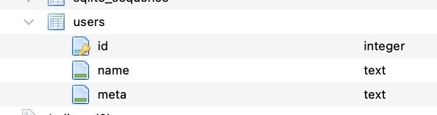
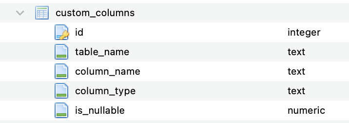
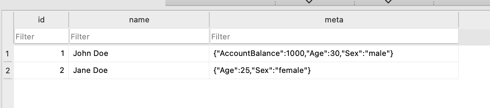

# dynamic-columns

## table structure

1. users
   
2. custom_columns
   

## running the app

```bash
make dev
```

## Seeded database



## sample query

```json
[
  { "column": "Age", "operator": ">", "value": 20 },
  { "column": "Sex", "operator": "=", "value": "female" }
]
```

## base64 encode the query

```bash
echo '[{"column":"Age","operator":">","value":20},{"column":"Sex","operator":"=","value":"female"}]' | base64
```

output

```text
W3siY29sdW1uIjogIkFnZSIsICJvcGVyYXRvciI6ICI+IiwgInZhbHVlIjoyMH0seyJjb2x1bW4iOiAiU2V4IiwgIm9wZXJhdG9yIjogIj0iLCAidmFsdWUiOiJmZW1hbGUifV0=
```

## urlcode the query

```bash
echo 'W3siY29sdW1uIjogIkFnZSIsICJvcGVyYXRvciI6ICI+IiwgInZhbHVlIjoyMH0seyJjb2x1bW4iOiAiU2V4IiwgIm9wZXJhdG9yIjogIj0iLCAidmFsdWUiOiJmZW1hbGUifV0=' | urldecode
```

output

```text
W3siY29sdW1uIjogIkFnZSIsICJvcGVyYXRvciI6ICI%2BIiwgInZhbHVlIjoyMH0seyJjb2x1bW4iOiAiU2V4IiwgIm9wZXJhdG9yIjogIj0iLCAidmFsdWUiOiJmZW1hbGUifV0%3D
```

## Make http request

```bash
curl http://localhost:3000/users?filters=W3siY29sdW1uIjogIkFnZSIsICJvcGVyYXRvciI6ICI%2BIiwgInZhbHVlIjoyMH0seyJjb2x1bW4iOiAiU2V4IiwgIm9wZXJhdG9yIjogIj0iLCAidmFsdWUiOiJmZW1hbGUifV0%3D
```

expected output

```json
{
  "Data": [
    { "id": 2, "name": "Jane Doe", "meta": { "Age": 25, "Sex": "female" } },
    { "id": 4, "name": "Jane Doe", "meta": { "Age": 25, "Sex": "female" } }
  ],
  "Fields": [
    { "key": "meta.Age", "label": "Age", "show": false, "type": "number" },
    { "key": "meta.Sex", "label": "Sex", "show": false, "type": "text" },
    {
      "key": "meta.AccountBalance",
      "label": "AccountBalance",
      "show": false,
      "type": "number"
    },
    { "key": "meta.Age", "label": "Age", "show": false, "type": "number" },
    { "key": "meta.Sex", "label": "Sex", "show": false, "type": "text" },
    {
      "key": "meta.AccountBalance",
      "label": "AccountBalance",
      "show": false,
      "type": "number"
    }
  ]
}
```
